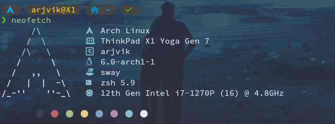

# Hi, I'm Arjun!

🌲 Stanford University
📍 Palo Alto, CA
⛓️ Systems/ML

Prev:
[⛵ SAIL](https://ai.stanford.edu/)
[🕸️ Etched](https://etched.com)
[🏦 Halliday](https://halliday.xyz)
[🐾 DagsHub](https://dagshub.com)
[🧪 UTSW](https://www.rajaramlab.org/)

Pubs:  
[Learning to (Learn at Test Time): RNNs with Expressive Hidden States](https://arxiv.org/abs/2407.04620)  
[Reverse Engineering Google Colab *(made it to top of HN!)*](https://news.ycombinator.com/item?id=31851031)  

  

